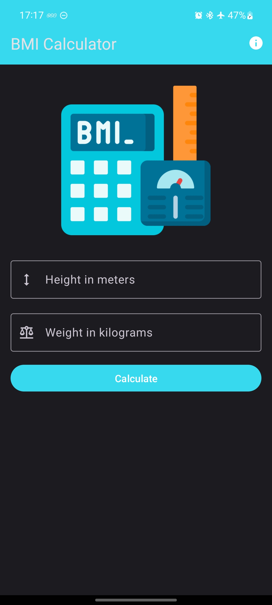

# BMI Calculator

<div style="display: flex; justify-content: space-around">
    
    
	
</div>


## What is BMI (Body Mass Index)?

The Body Mass Index (BMI) is a numerical value calculated from a person's weight and height. It's commonly used as an indicator of whether a person's weight is within a healthy range relative to their height. BMI provides a rough estimate of body fat and can help identify potential health risks associated with being underweight, overweight, or obese. The BMI value is calculated by dividing a person's weight in kilograms by the square of their height in meters. The resulting value is then categorized into different ranges, such as underweight, normal weight, overweight, and obese, each with associated health implications. However, it's important to note that BMI has limitations and doesn't directly measure body composition or factors like muscle mass, bone density, and distribution of fat. Therefore, while BMI can be a useful initial assessment tool, it's recommended to consider additional factors and consult a health care professional for a comprehensive evaluation of an individual's health.

<a href="https://www.flaticon.com/free-icons/bmi" title="bmi icons">Bmi icons created by Freepik - Flaticon</a>

```bash
MIT License

Copyright (c) 2023 Janssen Batista

Permission is hereby granted, free of charge, to any person obtaining a copy
of this software and associated documentation files (the "Software"), to deal
in the Software without restriction, including without limitation the rights
to use, copy, modify, merge, publish, distribute, sublicense, and/or sell
copies of the Software, and to permit persons to whom the Software is
furnished to do so, subject to the following conditions:

The above copyright notice and this permission notice shall be included in all
copies or substantial portions of the Software.

THE SOFTWARE IS PROVIDED "AS IS", WITHOUT WARRANTY OF ANY KIND, EXPRESS OR
IMPLIED, INCLUDING BUT NOT LIMITED TO THE WARRANTIES OF MERCHANTABILITY,
FITNESS FOR A PARTICULAR PURPOSE AND NONINFRINGEMENT. IN NO EVENT SHALL THE
AUTHORS OR COPYRIGHT HOLDERS BE LIABLE FOR ANY CLAIM, DAMAGES OR OTHER
LIABILITY, WHETHER IN AN ACTION OF CONTRACT, TORT OR OTHERWISE, ARISING FROM,
OUT OF OR IN CONNECTION WITH THE SOFTWARE OR THE USE OR OTHER DEALINGS IN THE
SOFTWARE.
```


